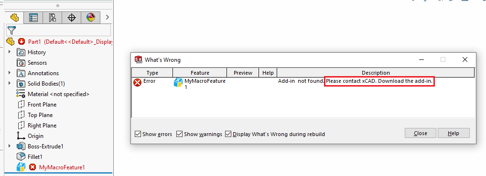

xCAD provides utilities for simplified development of SOLIDWORKS macro features based on the data model.

## What is macro feature?

Macro feature is a custom element which could be added into Feature Manager Design tree using SOLIDWORKS API. This element will behave in exactly the same way as any other standard feature (e.g. Boss-Extrude, Move-Copy Body, Mate, etc.)

Macro feature supports parametric nature of SOLIDWORKS and could regenerate if any of the parents changed.

Macro feature provides 3 main handlers

* Regeneration - called when feature is rebuilt (either as a result of model force rebuild operation or as a result of the updated of any of the dependencies). Macro feature can create new body or bodies or be only a metadata element.
* Edit - called when feature definition is requested to be edited by the user
* State update - called every time state is updated (i.e. feature is selected, refreshed etc.)

{ width=250 }

Macro feature can store additional metadata parameters (including dimensions and selection references).

xCAD allows to insert, edit, preview, generate macro feature within the same definition.

## Overview

Framework provides 3 main macro feature definition abstract classes which reside in the **Xarial.XCad.SolidWorks.Features.CustomFeature** namespace to be inherited in order to register new macro feature.

* **SwMacroFeatureDefinition** - simple macro feature. Macro feature doesn't require any parameters and will perform a a simle operation
* **SwMacroFeatureDefinition{TParams}** parameters driven macro feature. All of the required inputs can be defined within the *TParams* structure (data model). [Macro feature data](\data\) includes
    * Field Values (Named parameters)
    * Dimensions
    * Selections
    * Edit Bodies
* **SwMacroFeatureDefinition{TParams,TPage}** - parameters driven macro feature bound to page providing seamless integration with [property pages](/property-pages/) enabling edit and preview capabilities.

Macro feature class must be com visible.

It is recommended to explicitly assign guid and prog id for the macro feature.

<<< @/_src/CustomFeature/DefiningMacroFeature.cs

## Icon

Custom macro feature icon can be assigned via **IconAttribute**. Icon can be loaded from the resources and supports transparency.

## Options

Additional options can be assigned via **CustomFeatureOptionsAttribute**, such as displaying the feature at the end of the tree, caching body, etc.

Macro feature is a COM object which means it needs to be registered in order for macro feature to operate. Macro feature is stored within the model, but if model is opened in the environment where the Macro Feature COM object is not registered - rebuild error will be displayed. Furthermore this 'dangling' macro feature cannot be removed or suppressed.

User can specify the custom message to be displayed in the *What's Wrong* dialog via **MissingDefinitionErrorMessage** attribute. Specified message will be displayed after the predefined *Add-in not found. Please contact*

<<< @/_src/CustomFeature/UnregisteredMacroFeature.cs

{ width=650 }

To insert the macro feature use **IXFeatureRepository::PreCreateCustomFeature** or **IXFeatureRepository::CreateCustomFeature** methods.

Refer [Parametric Box](https://github.com/xarial/xcad-examples/tree/master/ParametricBox) example which demonstrates how to create a simple parametric box SOLIDWORKS feature with property page, preview and dimensions.