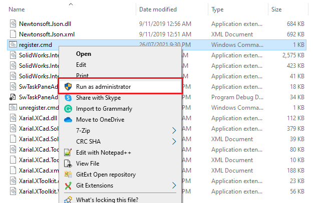

xCAD.NET automatically registers SOLIDWORKS add-in when add-in dll is registered with Regasm tool or build from Microsoft Visual Studio (unless explicitly disabled in the project settings). It is not required to additionally specify build event actions or add registry keys.

## Manual Deployment

The simplest way to deploy SOLIDWORKS add-in to other computer is to copy the output of bin directory to the target machine and run regasm tool with **/codebase** switch:

~~~
"%Windir%\Microsoft.NET\Framework64\v4.0.30319\regasm" /codebase "PATH TO ADDIN DLL"
~~~

> It might be required to run this script with administrative previledges

In order to uninstall the add-in it is required to run the following command

~~~
"%Windir%\Microsoft.NET\Framework64\v4.0.30319\regasm" /codebase "PATH TO ADDIN DLL" /u
~~~

### Adding Command Line Scripts

The process can be improved by creating the .cmd script which can be placed in the output directory. In this case it will be simply required to execute this script from the Windows File Explore.

Content of **register.cmd** file

~~~
"%windir%\Microsoft.NET\Framework64\v4.0.30319\RegAsm.exe" /codebase "%~dp0[NAME OF THE ADDIN FILE].dll"
~~~

Content of **unregister.cmd** file

~~~
"%windir%\Microsoft.NET\Framework64\v4.0.30319\RegAsm.exe" /codebase "%~dp0[NAME OF THE ADDIN FILE].dll" /u
~~~

## Creating MSI Installers

For more advanced experience MSI-installers can be created. This will enable an installation wizard and allow admin image installation. Product will be availble in Windows Control panel and can be repaired or uninstalled.

There are multiple solutions (free and paid) available. 

### Visual Studio Installer (VSI)

### Windows Installer XML (WiX)
