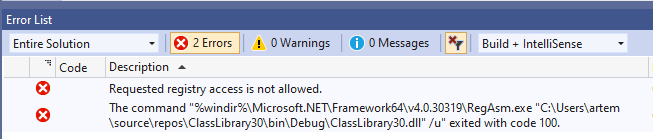
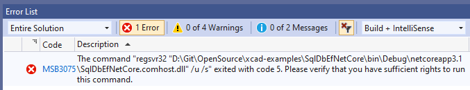
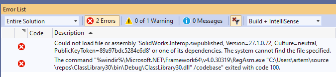
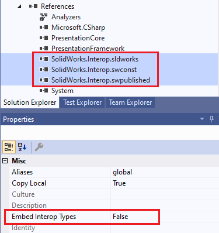

## Insufficient Permissions

### Symptoms

*Requested registry access is not allowed*

or *The command 'regsvr32' exited with code 5*

error is displayed during the build process.

### Cause

Registration may require administrative privileges and IDE (e.g. Visual Studio or Visual Studio Code) is not run *As Administrator*

### Resolution

* Run IDE As Administrator
* If the above does not help, try deleting the bin folder, in some cases it can resolve the issue
* Alternatively, [disable](/extensions/registering/) automatic registration and register add-in manually from the command line

## Embedded SOLIDWORKS Interops

### Symptoms

*Could not load file or assembly 'SolidWorks.Interop.Published'* error is displayed when building or cleaning project.

### Cause

xCAD (when used in .NET Framework) requires the the SOLIDWORKS interop files to be available in the output directory for the proper loading.

xCAD automatically sets the *Embed Interop Types* option to *False* for all necessarily libraries when nuget package is installed. However in some cases (upgrade to package or specific version of Nuget package manager) this may result into the libraries to be set as embedded.

### Resolution

Manually change the *Embed Interop Types* option to *False* for the SOLIDWORKS interops.

