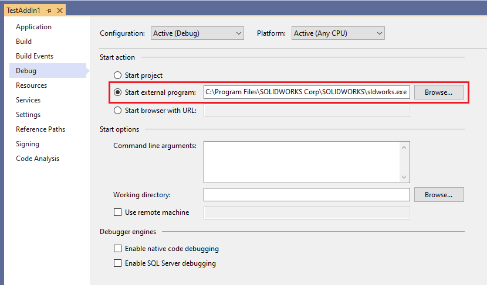
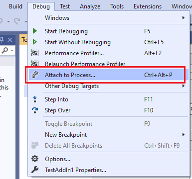
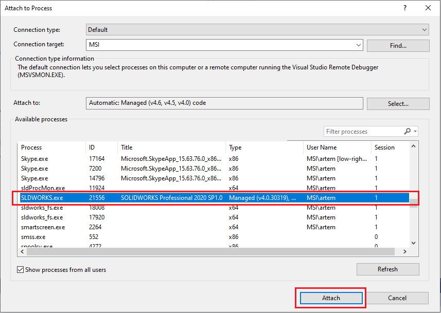

SOLIDWORKS add-ins are in-process applications hosted within the **sldworks.exe** process.

When debugging SOLIDWORKS add-ins it is recommended to specify the full path to the SOLIDWORKS executable for the **Start external program** option in the project settings under the **Debug** tab.

{ width=600 }

In this case it is possible to launch SOLIDWORKS and attach to the process automatically directly form Visual Studio by calling **Start** command or clicking **F5**

To attach to the running SOLIDWORKS instance use the **Debug->Attach To Process...** command

and select **SLDWORKS.exe** process form the list

{ width=600 }