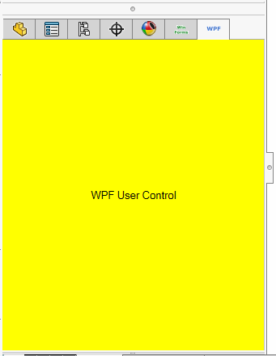

xCAD framework allows to add custom [Windows Forms controls](https://docs.microsoft.com/en-us/dotnet/api/system.windows.forms.usercontrol) and [WPF controls](https://docs.microsoft.com/en-us/dotnet/api/system.windows.controls.usercontrol) into Feature Manager tabs.

This functionality is only available for Part and Assembly documents

Decorate the control classes with **TitleAttribute** and **IconAttribute** to assign a tab tooltip and icon.

