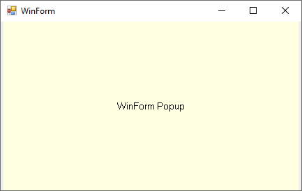
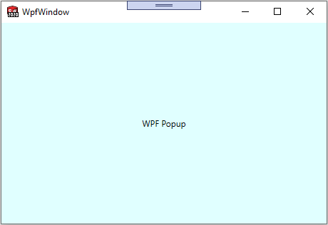

xCAD framework allows to show custom [Windows Form](https://docs.microsoft.com/en-us/dotnet/api/system.windows.forms.form) and [WPF Window](https://docs.microsoft.com/en-us/dotnet/api/system.windows.window) as a popup window.

Framework will automatically assign SOLIDWORKS window as a parent window for the forms.

