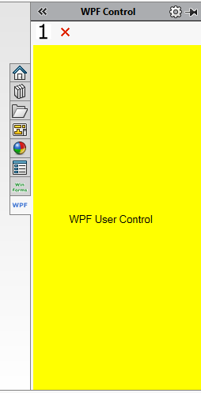

xCAD framework allows to add custom [Windows Forms controls](https://docs.microsoft.com/en-us/dotnet/api/system.windows.forms.usercontrol) and [WPF controls](https://docs.microsoft.com/en-us/dotnet/api/system.windows.controls.usercontrol) into Task Pane View.

Decorate the control classes with **TitleAttribute** and **IconAttribute** to assign tooltip and icon.

## Simple Task Pane

Taskpane can be created by calling the method below. Pointer to **IXTaskPane** provides an access to underlying properties and the pointer to the created control.

<<< @/_src/Extension\Panels\PanelsAddIn.cs#TaskPaneSimple

## Commands Task Pane

Additionally task pane can contain custom command buttons.

<<< @/_src/Extension\Panels\PanelsAddIn.cs#TaskPaneCommands