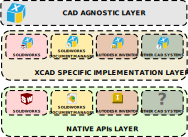

Framework provides utilities for implementation software design principles such as [S.O.L.I.D](https://en.wikipedia.org/wiki/SOLID), [type safety](https://en.wikipedia.org/wiki/Type_safety), **single point of maintenance** for developing maintainable and scalable solutions for SOLIDWORKS and other CAD systems.

## Architecture

{ width=800, style="margin: 0 auto" }
