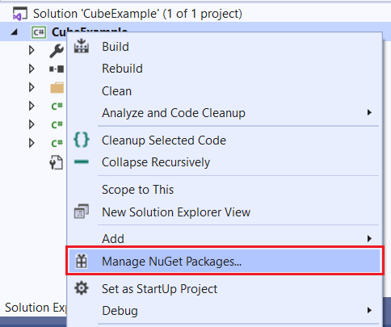
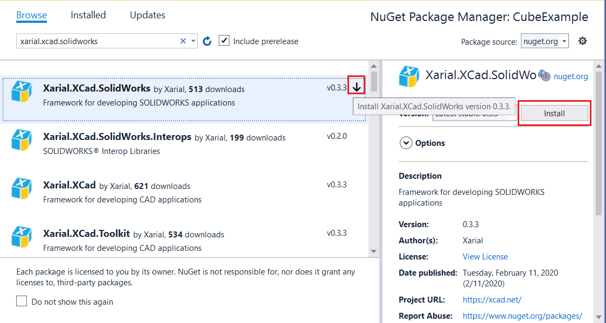
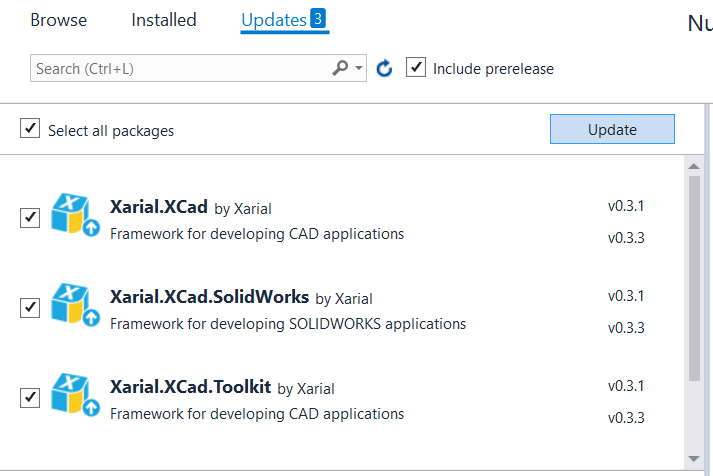

## Installing NuGet package

Select *Manage NuGet Packages...* command from the context menu of the project in Visual Studio

{ width=400 }

Search for *Xarial.xCAD.SolidWorks* in the search box. Once found click *Install* button for the required framework.

{ width=600 }

This will install all required libraries to the project.

## Updates

xCAD framework is actively developing and new features and bug fixes released very often. 

Nuget provides very simple way of upgrading the library versions. Simply navigate to Nuget Package manager and check for updates:

{ width=400 }

## Supporting multiple versions of the xCAD framework

Methods signatures and behaviour of xCAD framework might change in new versions. xCAD libraries are strong named which prevents the compatibility conflict in case several add-ins loaded in the same session of SOLIDWORKS referencing different versions of framework.