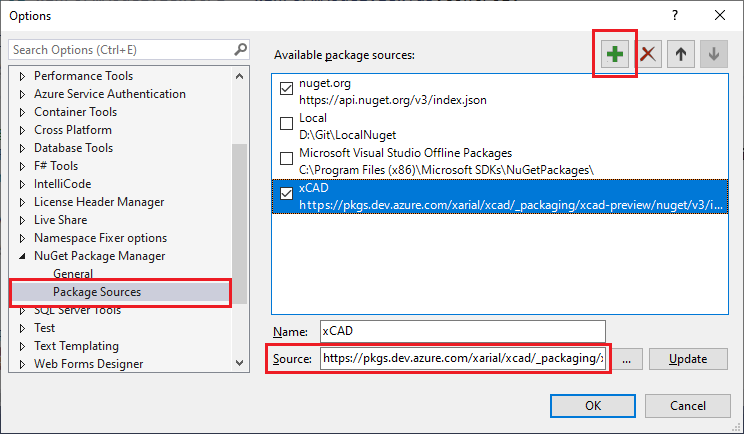
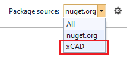
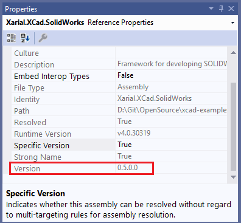

All production releases of xCAD.NET framework are automatically published to the [Nuget.org](Nuget.org).

All intermediate preview releases (from the dev branch) are published to the separate server in Azure dev ops which is publically available. All users can install the preview build to test new features.

Below are the instructions of settings up the nuget source which points to the preview nuget feed.

## Adding new nuget source

* Navigate to the Nuget Package Manager Settings in the Visual Studio

{ width=400 }

* Create new nuget source.
  * Name it *xCAD* (any other name can be used as well).
  * Specify the url of nuget feed [https://pkgs.dev.azure.com/xarial/xcad/_packaging/xcad-preview/nuget/v3/index.json](https://pkgs.dev.azure.com/xarial/xcad/_packaging/xcad-preview/nuget/v3/index.json) as the source

{ width=600 }

## Installing the libraries from the preview nuget feed

* Open the package manager as described in [installation](/installation) article
* Select the *Xarial* from the source drop-down

* Check *Include prerelease* option.

* Now all the xCAD libraries from the preview feed are available. Install/update them in the same way as public releases

## Versioning

Nuget packages from the preview feed would have a different versioning scheme:

> v[Major].[Minor].[Revision]-[BuildNumber]

where [BuildNumber] is a date in and build index:

> yyyyMMdd.Index

Major, minor and revision would always be higher of the public available version which will allow nuget to recognize this as an update.

## Usage

It is only recommended to use preview versions of the library for testing purpose.

Note, that the version of the dlls will not include the build number and might introduce conflict with the publicly released version once it is released.

Once testing is complete, simply select nuget package source from the drop down and reinstall public version.

