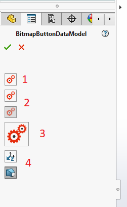
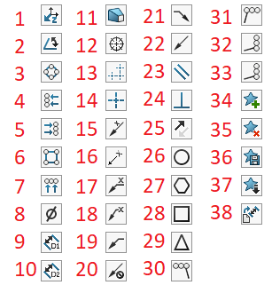

This control allows to assign image onto the [button](../button/) or [toggle](../check-box/)

1. Button with bitmap
1. Checked and unchecked toggles with bitmap
1. Large button
1. Standard images in the buttons

## Button

Decorate the property of type **Action** with **Xarial.XCad.UI.PropertyPage.Attributes.BitmapButtonAttribute** in order to create bitmap button control.



## Toggle

Decorate the property of type **bool** with **Xarial.XCad.UI.PropertyPage.Attributes.BitmapButtonAttribute** in order to create bitmap toggle control.



## Size

Default size of the button is 24x24 pixels. Use the **width** and **height** parameters of the constructor to assign custom size.



## Standard

Use constructor overload to specify standard bitmap for the button.



1. AlongZ
1. Angle
1. AutoBalCircular
1. AutoBalLeft
1. AutoBalRight
1. AutoBalSquare
1. AutoBalTop
1. Diameter
1. Distance1
1. Distance2
1. Draft
1. DveButCmarkBolt
1. DveButCmarkLinear
1. DveButCmarkSingle
1. LeaderAngAbove
1. LeaderAngBeside
1. LeaderHorAbove
1. LeaderHorBeside
1. LeaderLeft
1. LeaderNo
1. LeaderRight
1. LeaderYes
1. Parallel
1. Perpendicular
1. ReverseDirection
1. RevisionCircle
1. RevisionHexagon
1. RevisionSquare
1. RevisionTriangle
1. StackLeft
1. StackRight
1. StackUp
1. Stack
1. FavoriteAdd
1. favoriteDelete
1. FavoriteSave
1. FavoriteLoad
1. DimensionSetDefaultAttributes