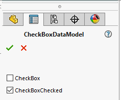

CheckBox control (toggle) will be automatically created for all properties of **bool** type.

<<< @/_src/PropertyPage/Controls/CheckBox.cs

Visit [toggle bitmap button](../bitmap-button/index#toggle) for more information of how to create toggle button with image.
