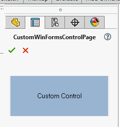
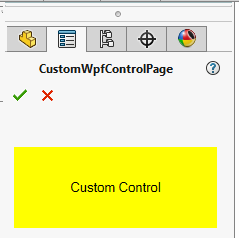

Custom control can be assigned to the property in the data model using the **CustomControlAttribute** and specifying the type of the control to render.

Both [Windows Forms controls](https://docs.microsoft.com/en-us/dotnet/api/system.windows.forms.usercontrol) and [WPF controls](https://docs.microsoft.com/en-us/dotnet/api/system.windows.controls.usercontrol) are supported.

## Hosting Windows Forms Control

Create a property of any type which will represent data model bound to the control.



In order to properly associate data model with property manager page, it is required to implement the **IXCustomControl** interface in the windows forms control.



Framework will bind **DataContext** property to the corresponding property in the data model of property manager page.

## Hosting WPF Control

Create a property of any type which will represent data model bound to the control.



The value of this property will be automatically assigned to the [FrameworkElemet::DataContext](https://docs.microsoft.com/en-us/dotnet/api/system.windows.frameworkelement.datacontext) property of the control. So it is possible to use WPF binding.

