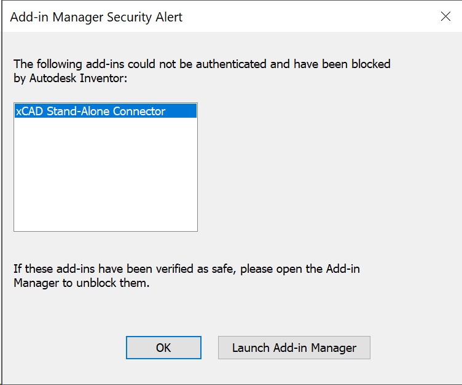
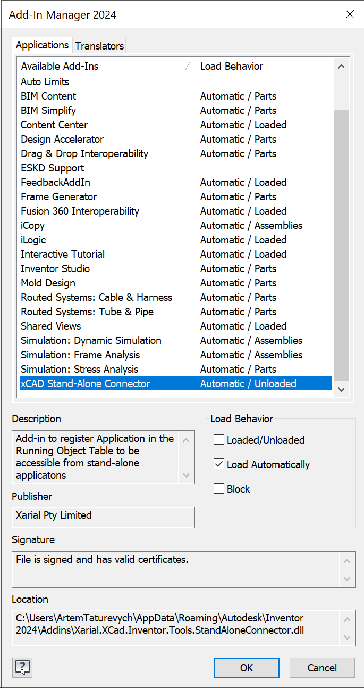

xCAD framework can be used to create out-of-process (stand-alone) applications, such as Console, Windows Forms, WPF etc. in .NET Framework or .NET Core.



## SOLIDWORKS

Call **SwApplicationFactory.Create** to connect to SOLIDWORKS instance in one of the following ways:

* To the specified SOLIDWORKS version
* To the latest SOLIDWORKS version (set the value of *vers* parameter to null)
* By optionally providing additional arguments

In order to connect to existing (running process of SOLIDWORKS) use **SwApplicationFactory.FromProcess** method and pass the pointer to [Process](https://docs.microsoft.com/en-us/dotnet/api/system.diagnostics.process?view=netcore-3.1)



Refer [Console Model Generator](https://github.com/xarial/xcad-examples/tree/master/ModelGeneratorConsole) example which demonstrates how to access xCAD.API from .NET Core console.

## SOLIDWORKS Document Manager

In order to use [SOLIDWORKS Document Manager API](https://help.solidworks.com/2021/english/api/swdocmgrapi/GettingStarted-swdocmgrapi.html), it is required to request a [Document Manager license key](https://www.codestack.net/solidworks-document-manager-api/getting-started/create-connection#activating-document-manager).

## Inventor

In order to enable the support of multiple sessions of Inventor application, install the add-in from the nuget package installation

* Copy files from the **tools\StandAloneConnector** folder in the **Xarial.XCad.Inventor** nuget package  installation folder
* Place files into the **%appdata%\Autodesk\Inventor {Version}\Addins**
* Start Inventor application. The following message is displayed

{ width=400 }

* Click **Launch Add-in manager** button and unblock the add-in

{ width=400 }