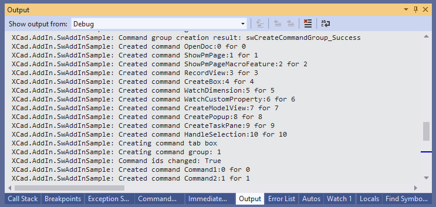
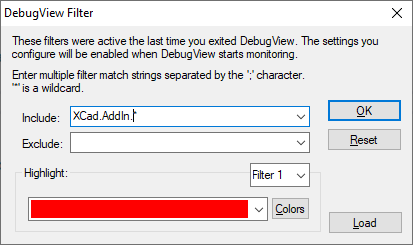
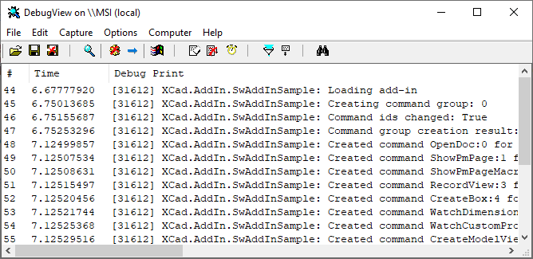
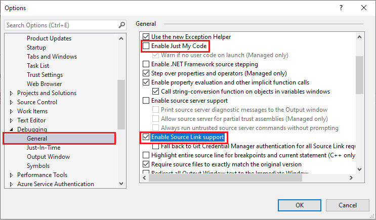
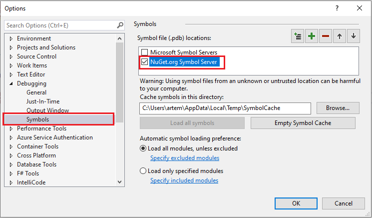
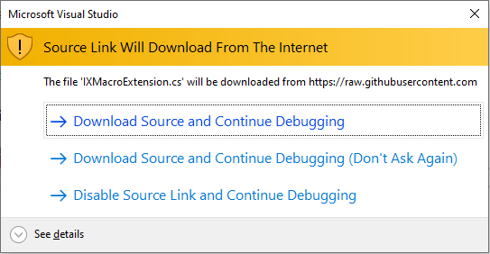

xCAD framework outputs the trace messages which simplifies the troubleshooting process. The messages are output to the default trace listener. Message category is set to **XCad.AddIn.[AddIn Name]**

If add-in is debugged from Visual studio than the messages are output to Visual studio Output tab as shown below:

{ width=450 }

Otherwise messages can be traced via [DebugView](https://docs.microsoft.com/en-us/sysinternals/downloads/debugview) utility by Microsoft

* Download the utility from the link above
* Unzip the package and run *Dbgview.exe*
* Set the settings as marked below:

Enable *Capture Win32* and *Capture Events* options from the toolbar (marked in red) 
    
{ width=450 }

Alternatively set the capture options via menu as shown below:

{ width=350 }

Set the filter to filter xCAD messages by clicking the filter button (marked in green)

{ width=350 }

Messages will be output to trace window

{ width=450 }

Use *eraser* button to clean messages (marked in blue)

## Notes

* Trace output is very powerful tool for troubleshooting the add-in on clients computers
* DebugView tool is lightweight and doesn't require installation and is provided by Microsoft
* Trace messages will be also output in the release mode
* xCAD framework will output the exception details if thrown while loading of the add-in which can help solving the problem when add-in cannot be loaded

Custom messages and exceptions can be logged from xCAD module. Log can be accessed from **IXExtension::Logger** property allowing to log custom messages and exception from the module.

<<< @/_src/LogAddIn.cs

## Debugging xCAD.NET Source Code

Starting from version 0.6.0 xCAD.NET supports Source Link allowing to step into original source code directly from the nuget package.

To enable Source Link for xCAD.NET

* Set the options in *Debugging* section of Visual Studio options dialog as below
    * Unselect *Enable Just My Code* option
    * Select *Enable Source Link support* option

* Select *NuGet.org Symbol Server* in the *Symbols* section

Now it is possible to press F11 or click step into command to debug the source code of xCAD.NET. The following warning will be displayed. Select the appropriate option

> Note. It is recommended to disable Source Link when not used

See below the video demonstration of debugging the xCAD.NET source code using Source Link

<!--youtube id: dUzFDly9okA-->